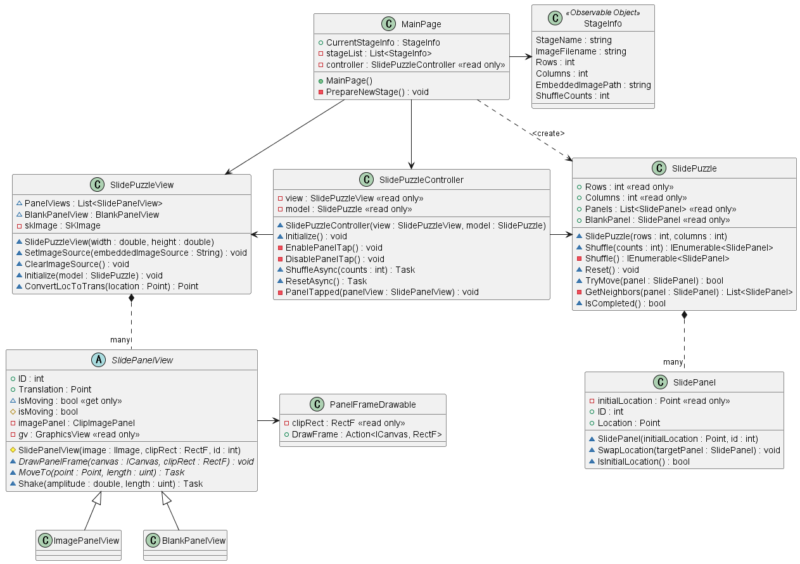
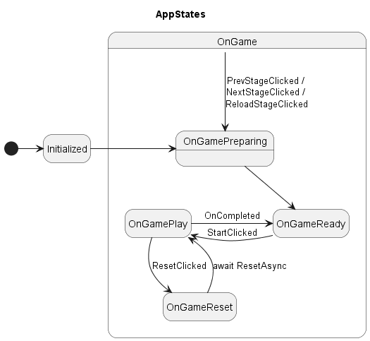
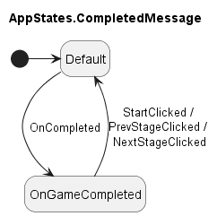
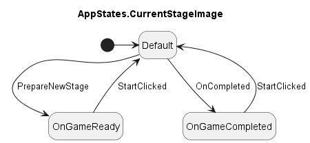

# MauiSlidePuzzle

A sample game of sliding puzzles.

<div>
<video controls src="https://user-images.githubusercontent.com/7810461/231326950-ed50f28b-ab1f-4aae-bac3-a3bf69e7fa77.mp4"></video>
</div>

## Files editted

<details>
<summary>Details</summary>

 - MauiSlidePuzzle/
     - Controllers/
         - [SlidePuzzleController.cs](./MauiSlidePuzzle/Controllers/SlidePuzzleController.cs)
     - CustomViews/
         - [BlankPanelView.cs](./MauiSlidePuzzle/CustomViews/BlankPanelView.cs)
         - [ClipImagePanel.cs](./MauiSlidePuzzle/CustomViews/ClipImagePanel.cs)
         - [ImagePanelView.cs](./MauiSlidePuzzle/CustomViews/ImagePanelView.cs)
         - [PanelFrameDrawable.cs](./MauiSlidePuzzle/CustomViews/PanelFrameDrawable.cs)
         - [SlidePanelView.cs](./MauiSlidePuzzle/CustomViews/SlidePanelView.cs)
         - [SlidePuzzleView.cs](./MauiSlidePuzzle/CustomViews/SlidePuzzleView.cs)
     - Models/
         - [SlidePanel.cs](./MauiSlidePuzzle/Models/SlidePanel.cs)
         - [SlidePuzzle.cs](./MauiSlidePuzzle/Models/SlidePuzzle.cs)
         - [StageInfo.cs](./MauiSlidePuzzle/Models/StageInfo.cs)
     - Resources/
         - Fonts/
             - [FontLicenseNotice](./MauiSlidePuzzle/Resources/Fonts/FontLicenseNotice)
         - Images/
             - Puzzles/
         - Raw/
             - Puzzles/
     - [MainPage.xaml](./MauiSlidePuzzle/MainPage.xaml)
     - [MainPage.xaml.cs](./MauiSlidePuzzle/MainPage.xaml.cs)
     - [MauiProgram.cs](./MauiSlidePuzzle/MauiProgram.cs)
     - [MauiSlidePuzzle.csproj](./MauiSlidePuzzle/MauiSlidePuzzle.csproj)
     - [PuzzleResourceHelper.cs](./MauiSlidePuzzle/PuzzleResourceHelper.cs)
 - uml/
     - [MauiSlidePuzzle.puml](./uml/MauiSlidePuzzle.puml)
</details>

## UML

<details>
<summary>Class diagram (partial)</summary>



</details>

<details>
<summary>Visual states of MainPage</summary>



</details>

<details>
<summary>Visual states of CompletedMessage</summary>



</details>

<details>
<summary>Visual states of CurrentStageImage</summary>



</details>

## What I learnt from this project

- How to use EmbeddedResources
- How to use SkiaSharp and SKCanvasView
- What the MVC (Model-View-Controller) pattern is
- How to add fonts and use image fonts
- How to write MIT license credits
- How to use non-default constructors in xaml
- How to use VisualState
- How to pass Json data to the constructor (Json constructor)

### Include and access EmbeddedResources

In the .csproj file, add EmbeddedRecource tags like
``` xml
<ItemGroup>
...
    <EmbeddedResource Include="Resources\Images\Puzzles\*" />
...
    <EmbeddedResource Include="Resources\Raw\Puzzles\*" />
...
</ItemGroup>
``` 

Then, in a code, you can access the contents of a specified embedded resource via a resource ID (_ex. MauiSlidePuzzle.Resources.Images.Puzzles.myshapes.png_).

### Use SkiaSharp and SKCanvasView

Using the view controls from SkiaSharp library, you should tell the maui app to use SkiaSharp in MauiProgram.cs:
```csharp
var builder = MauiApp.CreateBuilder();
builder
    .UseSkiaSharp(true)
    .UseMauiApp<App>()
    ...
```
Without this statement, you will encounter the error with the unhundled exception such as,
> Microsoft.Maui.Platform.HandlerNotFoundException: 'Handler not found for view SkiaSharp.Views.Maui.Controls.SKCanvasView.'

